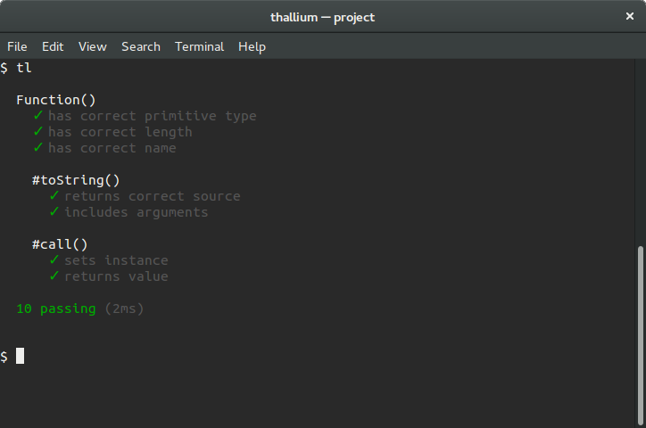
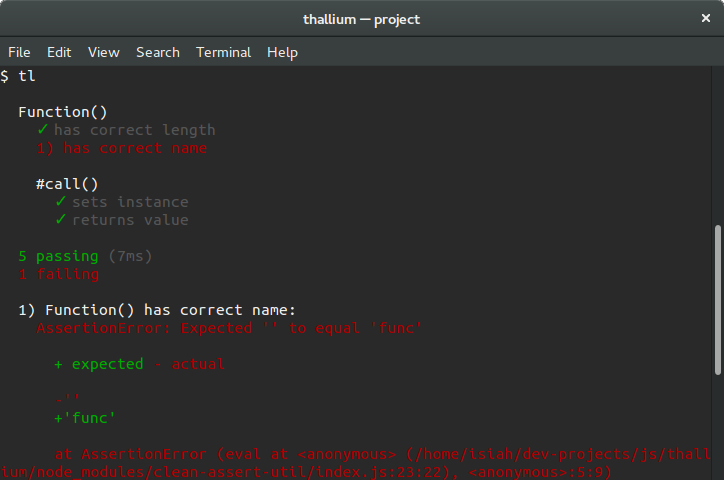
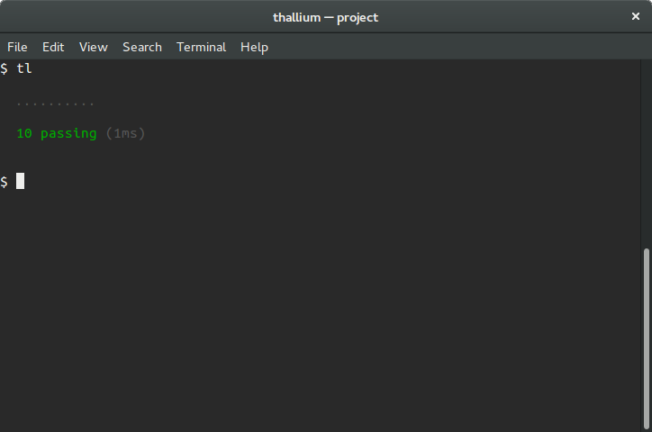
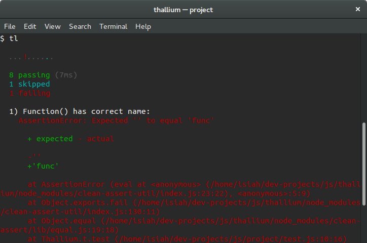
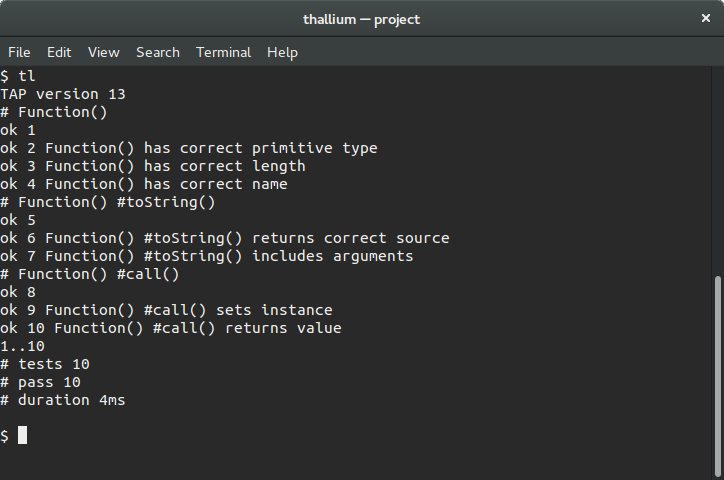
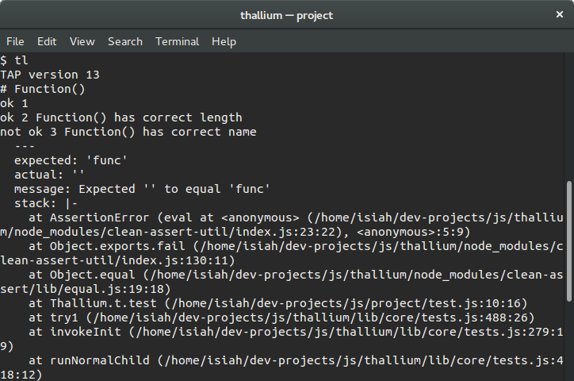
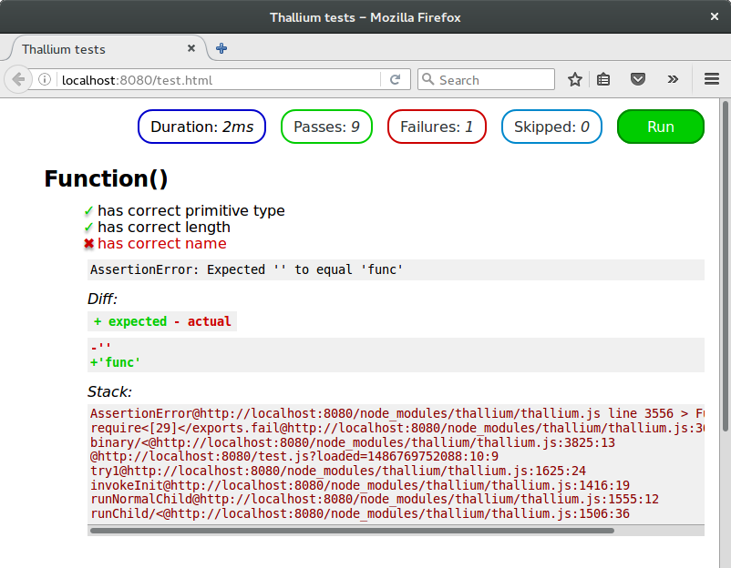

*[Up](./README.md)*

# Reporters

Thallium comes with a few useful built-in reporters to start with. If you are interested in writing your own, look [here](./reporter-api.md) instead. Here are the built-in ones:

### Spec

This is the default reporter, inspired by (and mostly a copy of design-wise) Mocha's `spec` reporter.

```js
t.reporter(require("thallium/r/spec"))
```





### Dot

This is a more minimal reporter, where failing tests are marked by exclamation points, skipped tests blue dots, and slow tests yellow dots. It's inspired by Mocha's `dot` reporter, and looks fairly similar to it.

```js
t.reporter(require("thallium/r/dot"))
```





### TAP

A [TAP-compatible](https://testanything.org) reporter, for you to use with various tools.

```js
t.reporter(require("thallium/r/tap"))
```





### DOM

Although it's technically a [complete runner](./dom.md), it's presented here because it also features its own reporter.



## Options

Each built-in reporter also accepts various options, so you may change how the output is printed (i.e. if you're printing it to a non-terminal). These aren't necessarily accepted by all reporters, so do be aware of that.

- `write(string)`

    This is called with a string to print to the console, with newlines already normalized to the platform. This may return a thenable resolved when done.

    *Accepted by:* `tap`, `dot`, `spec`

- `reset()`

    This is called at the end of the stream, after all events are processed. This may return a thenable resolved when done.

    *Accepted by:* `tap`, `dot`, `spec`

- `color`

    A boolean for whether to use terminal color escapes in the output, regardless of whether the output is a terminal or not. Note that `--color` and `--no-color` on the command line and the environment variables `FORCE_COLOR` and `FORCE_NO_COLOR` take precedence over this.

    *Accepted by:* `dot`, `spec`

Note that for reporters that accept both `print` and `write`, you *have* to provide either neither or both, or you won't get the complete output, and the output you do get is completely undefined. Also, if you provide `print` and/or `write`, you must also pass `reset`.

Here's what options the reporters themselves accept:

- `thallium/r/tap` - `write(line)` and `reset()`
- `thallium/r/spec` - `write(line)`, `reset()`, and `color`
- `thallium/r/dot` - `write(string)`, `reset()`, and `color`
